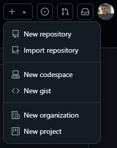
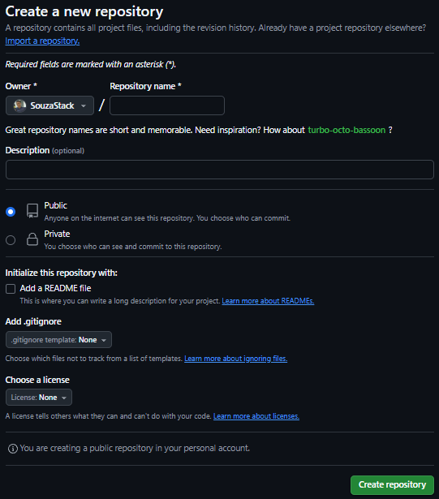
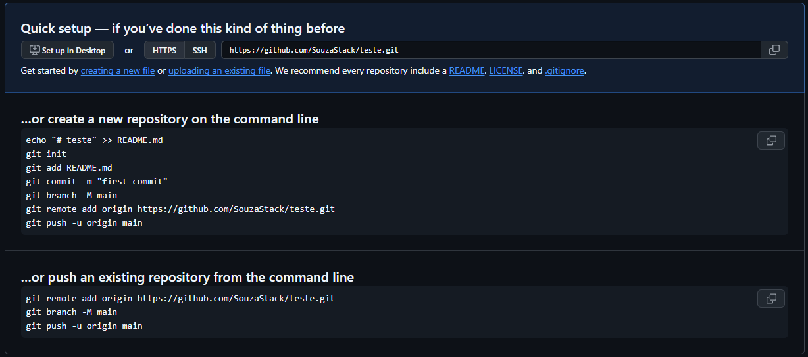

# Guia rápido e Comandos básicos Git e Github

- O **Git** é um repositório(inventário, coleção) para seus códigos. Com ele, você pode "_voltar ao passado_" no seu código, através do **commits**.

- O **Github** é o seu repositório na nuvem.

# Criando um repositório no GitHub
Acesse sua conta no **Github** e clique no sinal de mais para abrir o menu e em seguida em **New repository**.



Dê o nome de sua preferência, além da descrição e indique se seu repositório será público ou privado.



Para finalizar, clique em **Create repository**.

Em seguida aparecerá uma tela com três opções:



- A primeira diz respeito a crianção de um **novo repositório** (inclui a inicialização do **Git** no diretório local).

- A segunda diz respeito a um **repositório já existente** e que desejo colocar no GitHub (é a situação que irei utilizar).

- A terceira diz respeito a **importação** de um código de outro repositório.

# Criando repositório local

Na pasta do seu projeto sera criado uma pasta chamada .git e é ali que contem toda a funcionabilidade Git, então não apague.

```
git init
```

##### Verificar estado dos arquivos/diretórios:

```
git status
```

##### Adicionando seus arquivos ao Git

```
git add nome_do_arquivo
```


##### Isso adiciona o arquivo `README.md` à área de **staging**. 

```
git add README.md
``` 

##### Adicionar todos os arquivos de uma só vez:
```
git add .
```

##### Agora é preciso fazer o commit para que o Git possa rastrear suas modificações:

```
git commit -m "descrição"
```

O `git commit` salva as alterações no repositório, com uma mensagem que explica as mudanças feitas. Mensagens bem escritas são fundamentais para um histórico claro e organizado.

##### Atualizando commit de arquivo modificado

```
git commit -am 'descrição'
```

# Ligando seu repositório local ao GitHub

Após criar o repositório no **GitHub**, você verá uma **URL** de acesso remoto do repositório. Ela será algo como `https://github.com/SeuUsuario/link-repositório`. Agora, você precisa associar o repositório local ao repositório remoto.

```
git remote add origin <link do repositório>
```

# Enviando suas alterações

Pela primeira vez é necessário **-u origin main** para dizer ao **Git** qual repositório remoto e branch usar por padrão. Isso evita que você precise repetir em futuros pushes.

```
git push -u origin main
``` 

#### Depois disso, basta usar `git push`, pois o **Git** já sabe para onde enviar suas alterações.

# Copiando um repositório

```
git clone link_repositório_que_deseja_copiar
```

# Criando branches

`git branch -M "main"` Este comando renomeia a branch principal do repositório de `master` para `main`. Essa **mudança** é **recomendada** para promover uma nomenclatura mais inclusiva e alinhada às práticas modernas adotadas por plataformas como o **GitHub**.

##### Listar branches existentes

```
git branch
``` 

##### Criando um novo branch e trocar

```
git checkout -b nome_do_branch
```

##### Trocando para um branch existente

```
git checkout nome_do_branch
```

##### Seus branches locais não estarão na nuvem a menos que você os envie.

```
git push origin nome_do_branch
```

##### Apagando um branch

```
git branch -D nome_do_branch
```

# Atualizando seu repositório local

##### Pega as modificações que foram feitas no repositório remoto.

```
git pull
```

# Desfazendo commits

```
git revert chave_do_commit
```

##### A chave do commit é encontrada através do comando:

```
git log
```